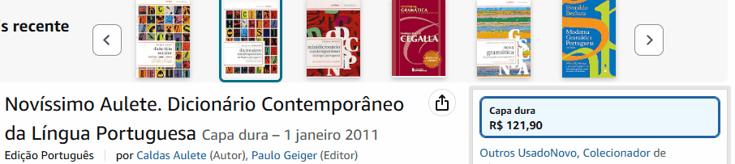

# Projeto com README
Um projeto de teste com arquivo README 😊

Fui orientada a seguir o passo a passo do mentor para criar um README.

 

Foi utilizado uma gravação de tela aleatória, apenas para
entender como faz para colocar imagens/GIF e exemplificar.

## As tecnologias utilizadas foram: 
- HTML
- CSS 
- JS 

## Como utilizar: 
 Leia e clique no GIF para ser direcionado para o Google